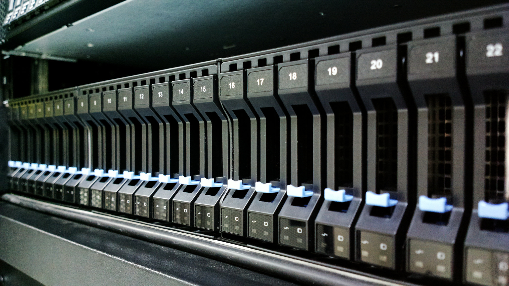

# Fast Data Applications with Spark

**Data and code for "Fast Data Applications with Spark and Python"** 

This repository contains materials for the District Data Labs course "Fast Data Applications with Python". Note that this repository is updated regularly, so please keep an eye on it for changes in the future!

## Data

Data can be downloaded from Dropbox at the following links:

- [DBLP](https://dl.dropboxusercontent.com/u/9448094/Datasets/District%20Data%20Labs/Spark%20Workshop/DBLP.tgz)
- [Lahman591](https://dl.dropboxusercontent.com/u/9448094/Datasets/District%20Data%20Labs/Spark%20Workshop/lahman591-csv.zip)
- [Ontime Flights](https://dl.dropboxusercontent.com/u/9448094/Datasets/District%20Data%20Labs/Spark%20Workshop/ontime.zip)
- [eCommerce](https://dl.dropboxusercontent.com/u/9448094/Datasets/District%20Data%20Labs/Spark%20Workshop/shopping.tgz)
- [War and Peace](https://dl.dropboxusercontent.com/u/9448094/Datasets/District%20Data%20Labs/Spark%20Workshop/tolstoy.txt.gz)
- [Wine Quality](https://dl.dropboxusercontent.com/u/9448094/Datasets/District%20Data%20Labs/Spark%20Workshop/winequality.tgz)
- [World Bank](https://dl.dropboxusercontent.com/u/9448094/Datasets/District%20Data%20Labs/Spark%20Workshop/world_bank.json.gz)
- [Olympics](https://dl.dropboxusercontent.com/u/9448094/Datasets/District%20Data%20Labs/Spark%20Workshop/olympics.tgz)
- [NBA Players](https://dl.dropboxusercontent.com/u/9448094/Datasets/nba_players.csv)

## Attribution

In this section we will (eventually) attribute all data sources and materials used in this course. 

- The DBLP data set is composed of a partial snippet of authorship from the [DBLP Computer Science Bibliography](http://dblp.uni-trier.de/)
- Lahman591 is a dataset of baseball statistics that we downloaded from a [Hortonworks Hive example](http://hortonworks.com/hadoop-tutorial/how-to-process-data-with-apache-hive/).
- The Ontime Flights dataset is wrangled heavily from the [US DOT Bureau of Statistics](http://www.transtats.bts.gov/DL_SelectFields.asp?Table_ID=236&DB_Short_Name=On-Time).
- War and Peace is from [Project Gutenberg](http://www.gutenberg.org/ebooks/2600)
- The Wine Quality data set is from the [UCI Machine Learning Repository](https://archive.ics.uci.edu/ml/datasets/Wine+Quality).
- The World Bank data set is from .
- The Olympics data set is generated from DBPedia and we got it from [Amol Deshpande at the University of Maryland](https://github.com/umddb). 
- The NBA Players dataset was generated by [Tony Ojeda](https://twitter.com/tonyojeda3) from statistics on the web. 

The image used at the top of this README, ["Data Center"](https://flic.kr/p/p1eNmA) by [Andrew Tseng](https://www.flickr.com/photos/arvidnn/) is licensed by  [CC BY-NC-SA 2.0](https://creativecommons.org/licenses/by-nc-sa/2.0/).
